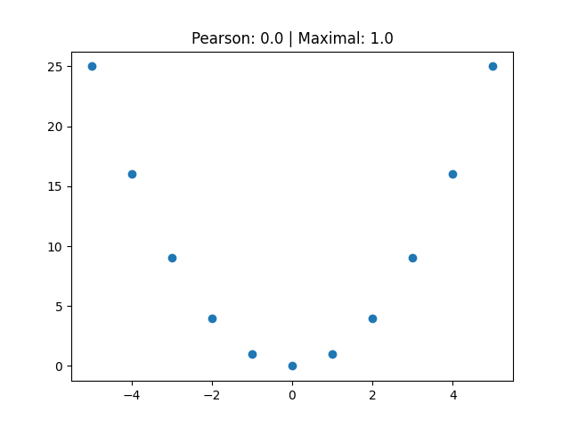

# maximal-correlation

Code to compute the maximal correlation coefficient, also known as Hirschfeld-Gebelein-Rényi (HGR) coefficient [1].

Code has been adapted from [2] using ChatGPT.

[1] Rényi, A., 1959. On measures of dependence. Acta mathematica hungarica, 10(3-4), pp.441-451.\
[2] Makur, A., 2016. Maximal Correlation Functions: Hermite, Laguerre, and Jacobi.
